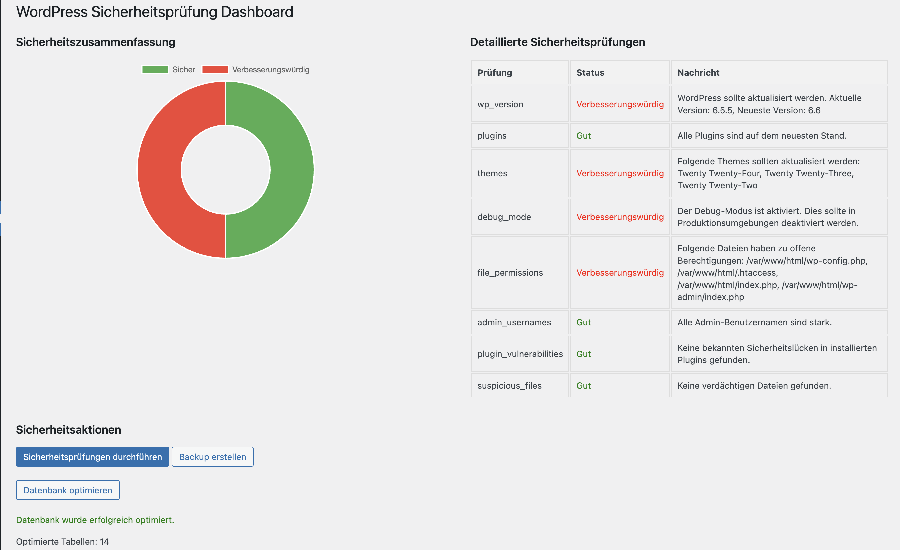

# WP-Sicherheitsprüfung

WP-Sicherheitsprüfung ist ein umfassendes WordPress-Plugin, das entwickelt wurde, um die Sicherheit Ihrer WordPress-Installation zu verbessern und zu überwachen.

## Funktionen

- **Sicherheitsprüfungen**: Führt verschiedene Sicherheitsprüfungen Ihrer WordPress-Installation durch, einschließlich:
  - WordPress-Versionsprüfung
  - Plugin- und Theme-Versionsprüfungen
  - Debug-Modus-Status
  - Dateiberechtigungen
  - Überprüfung von Admin-Benutzernamen
  - Prüfung auf Plugin-Sicherheitslücken
  - Suche nach verdächtigen Dateien
- **Backup-System**: Erstellt Backups Ihrer WordPress-Dateien und Datenbank.
- **Datenbank-Optimierung**: Optimiert Ihre WordPress-Datenbank für bessere Leistung.
- **Zwei-Faktor-Authentifizierung**: Fügt eine zusätzliche Sicherheitsebene für Administrator-Konten hinzu.
- **E-Mail-Benachrichtigungen**: Sendet Sicherheitsberichte per E-Mail.
- **Sicherheits-Dashboard**: Bietet eine visuelle Übersicht über den Sicherheitsstatus Ihrer Website.
- **Htaccess-Regeln**: Erstellt zusätzliche Sicherheitsregeln in der .htaccess-Datei.

## Installation

1. Laden Sie die Plugin-ZIP-Datei herunter.
2. Melden Sie sich in Ihrem WordPress-Admin-Panel an.
3. Gehen Sie zu Plugins > Neu hinzufügen > Plugin hochladen.
4. Wählen Sie die heruntergeladene ZIP-Datei aus und klicken Sie auf "Jetzt installieren".
5. Nach der Installation klicken Sie auf "Plugin aktivieren".

## Verwendung

Nach der Aktivierung können Sie auf die Funktionen des Plugins über das Menü "Sicherheitsprüfung" in Ihrem WordPress-Admin-Panel zugreifen.

1. **Sicherheitsprüfungen durchführen**: Klicken Sie auf "Sicherheitsprüfungen durchführen", um eine umfassende Sicherheitsüberprüfung Ihrer Website durchzuführen.
2. **Backup erstellen**: Verwenden Sie die Schaltfläche "Backup erstellen", um ein Backup Ihrer WordPress-Dateien und Datenbank zu erstellen.
3. **Datenbank optimieren**: Klicken Sie auf "Datenbank optimieren", um die Leistung Ihrer Datenbank zu verbessern.
4. **Einstellungen konfigurieren**: Passen Sie E-Mail-Benachrichtigungseinstellungen, Backup-Häufigkeit und andere Optionen in den Plugin-Einstellungen an.
5. **Zwei-Faktor-Authentifizierung**: Aktivieren Sie die Zwei-Faktor-Authentifizierung für Administrator-Konten in den Benutzereinstellungen.

## Screenshots

## Anforderungen

- WordPress 5.0 oder höher
- PHP 7.2 oder höher

## Support

Für Support, Funktionsanfragen oder Fehlerberichte öffnen Sie bitte ein Issue in diesem GitHub-Repository.

## Mitwirken

Beiträge sind willkommen! Bitte fühlen Sie sich frei, einen Pull Request einzureichen.

## Lizenz

Dieses Projekt ist unter der GPL v2 lizenziert.

## Autor

Entwickelt von [Pascal Stier](https://pascalstier.de)

## Changelog

### 1.0
- Erstveröffentlichung

---

Für weitere Informationen besuchen Sie [https://wp-security.pascalstier.de](https://wp-security.pascalstier.de)